# CamRaff - Milestone Project 1

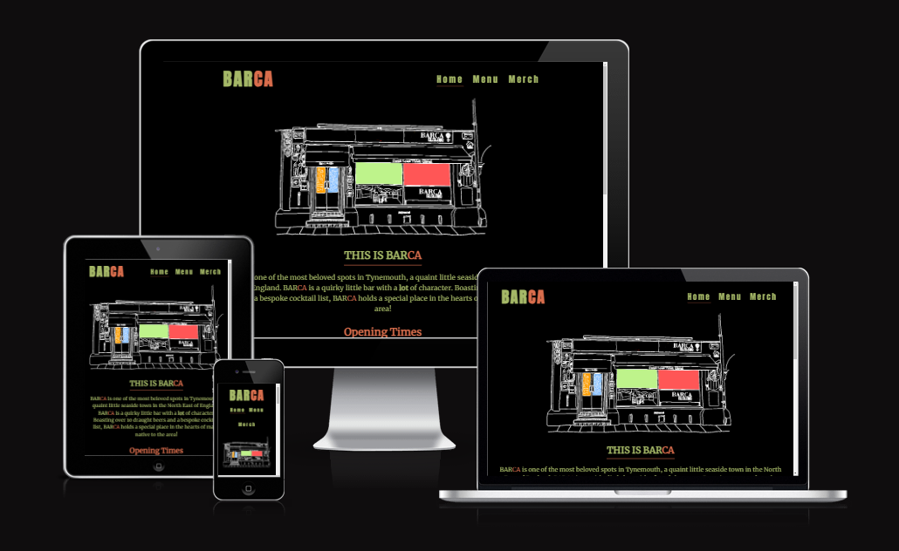

Here is a link to the deployed site: [Barca Tynemouth](https://camraff.github.io/milestone-project-1/ "Barca Tynemouth")

For my first Milstone Project on my course through Code Institute via UCP (University Centre Peterborough), I thought the best thing to do was to produce something I would be familiar with. I have worked at Barca in Tynemouth for around 6/7 years on and off. I had a little break where I tried my hand at Recruitment, however, this field of work wasn't for me. During my time in Recruitment I worked sourcing candidates adept in Salesforce, before moving to a different company where I worked sourcing talented individuals in the Games Industry. This is where I built more of a passion for IT myself and decided to try my hand at Developing. I found a bit of myself here and though I had no previous experience at all, I begun to enjoy working in this field and decided I wanted to make this into a career. So here is my first project. I have produced this project with only 2 months of experience overall in coding. This is just the beginning!

## Contents

- [User Experience](#user-experience-ux)
    
    - [User Stories](#user-stories)

- [Design](#design-and-development)
    
    - [Wireframes](#wireframes)

        - [Mobile](#mobile)
        
        - [Tablet](#tablet)

        - [Desktop](#desktop)

    - [Color Scheme](#color-scheme)

    - [Typography](#typography)

        - [Merriweather](#merriweather)

        - [Anton](#anton)
    
    - [Images](#images)

    - [Features](#features)

    - [Development](#development)

        - [Libraries, Websites and Programs](#libraries-websites-and-programs)

- [Deployment and Local Development](#deployment-and-local-development)

    - [Deployment](#deployment)

    - [Local Development](#local-development)

        - [Fork](#fork)

        - [Clone](#clone)

- [Testing](#testing)

    - [Automated](#automated)

        - [W3 Validator - HTML](#w3-validator---html)

        - [W3 Validator - CSS](#w3-validator---css)

        - [Lighthouse](#lighthouse)

    - [Manual](#manual)

        - [User Stories](#user-stories-1)
        
        - [Site Testing](#site-testing)

        - [Feature Testing](#feature-testing)

- [Credits](#credits)

    - [Outside Code](#outside-code)

    - [Images](#images-1)

    - [Core Content](#core-content)

    - [Acknowledgements](#acknowledgements)
---

## User Experience (UX)

### User Stories

#### First Time Visitors

- I want to understand what the situation with Barca Tynemouth is, like opening times and location.
- I want to get a feel for the vibe of the venue and menu.
- I am interested in purchasing merchandise if possible.
- I want to be able to access and navigate the website easily regardless of which device I choose to use.

#### Returning Visitors

- I want to see if there is any new events or merchandise available on the site.

#### Frequent Visitors

- I want the option to reach out via socials to get updates on events and merchandise.

---

## Design and Development

### Wireframes

The below Wireframes were created with responsive design in mind. The main focus was to produce a view on various screensizes which would maintain an overall aesthetic and appeal.

#### Mobile

This is the initial mock-up for all 3 pages on a mobile device.

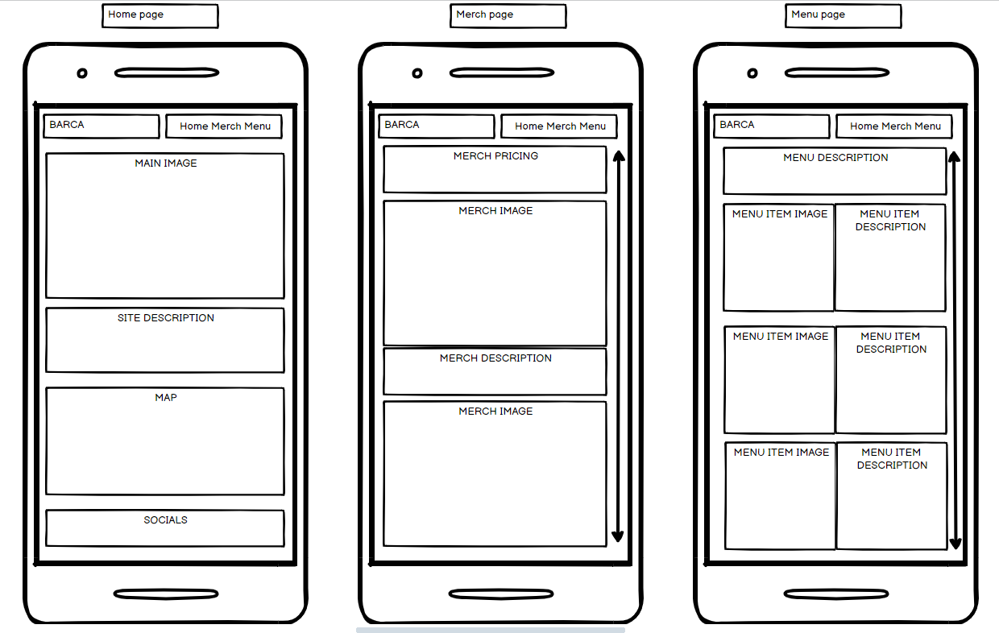

#### Tablet

This is an initial mock-up for the view of the merch page on a tablet. My vision for a tablet view would be to have the Home and Menu page look the same as on mobile, so with the only real changes being to the Merch page, I created a mock-up for that.

#### Desktop

Below are the mock-ups for each individual page when viewed on a desktop/laptop screen. 

- ##### Home page

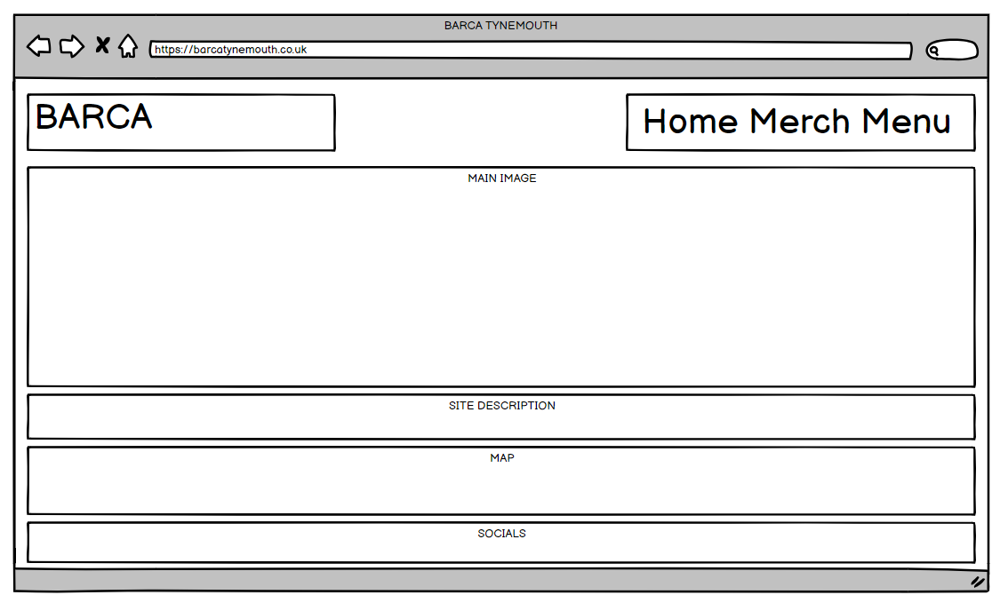

- ##### Merch page

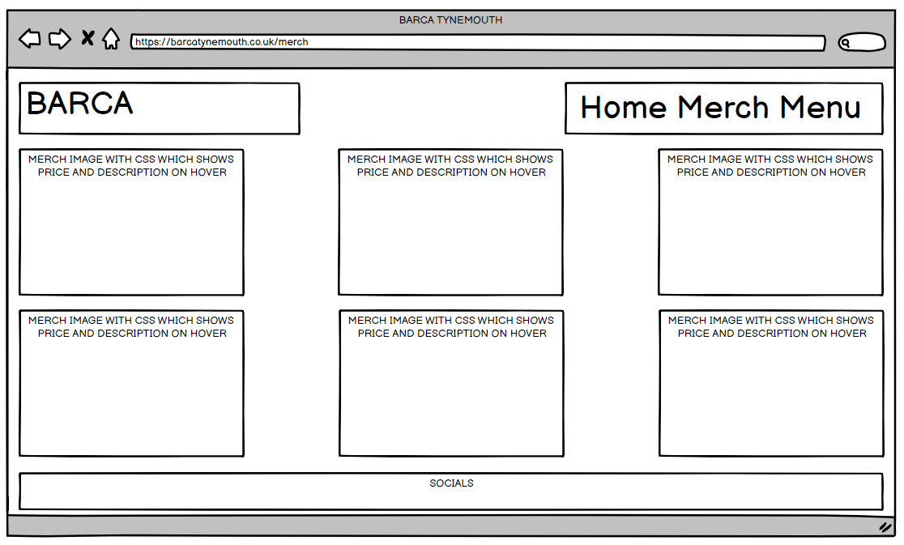

- ##### Menu page

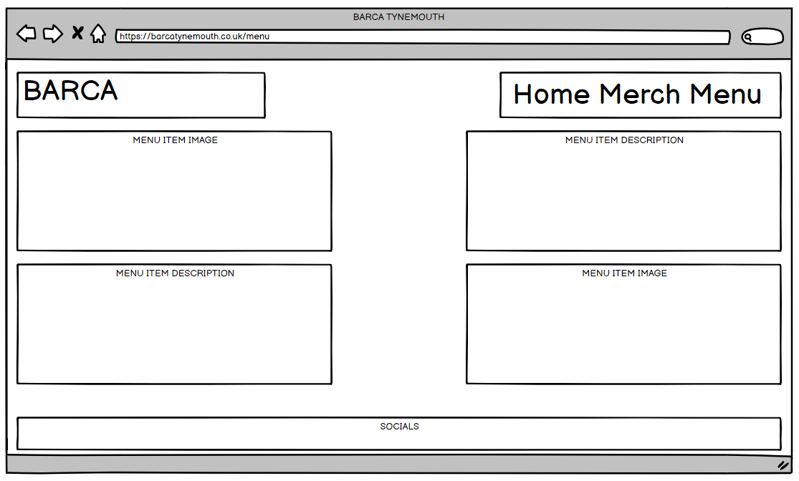

### Color Scheme

For the color scheme of the website, I decided to go with the original color palette from the logo you can see below.

I chose the green color for the body text, as well as the navigation menu, and decided to make it so that when you hover over the navigation links, they change to red. This is in keeping with the original logo with it being green to begin with, and then red at the end. I decided to also maintain the black backround, and this allows the text to stand out. 

For the green color, I went with the hexidecimal color `#a5b867`, as this was the closest I could get to the original green in the logo.

For the red color, I went with the hexidecimal color `#d96d4c`, as I feel like this is the best match to the original logo.

I feel that these colors work well together as there is good contrast between the two, and they also stand out really well against a black background.

### Typography

After spending some time looking over some fonts, I decided to go with [Merriweather](https://fonts.google.com/specimen/Merriweather/) for the body of the site, and [Anton](https://fonts.google.com/specimen/Anton/) for the header and navigation text. Both fonts were acquired from Google Fonts.

- #### Merriweather

I chose Merriweather for the body text font as I think it has a very friendly and inviting vibe, and I think with the color being a shade of green, some fonts wouldn't look quite as nice in this color, however Merriweather does. 

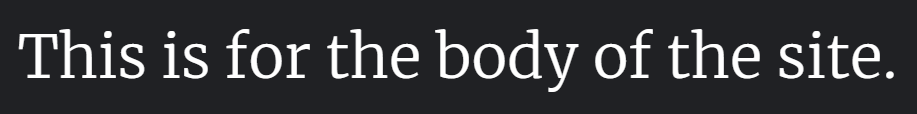

- #### Anton

I chose Anton for the header and navigation text as I felt that this font had a similar kind of sharpness too it as can be seen in the image above where I chose the color scheme from.

### Images

The image used on the home page was created by John Christensen, a staff member at Barca Tynemouth. Each of the merchandise images were taken by Beth Simpson, also a staff member at Barca Tynemouth.

For the social media links icons in the footer I used [Font Awesome](https://fontawesome.com/), with a link acquired from Code Institute.

For the image displayed in the browser tab, I used [Favicon](https://favicon.io/).

All of the images found on the menu page were taken by myself using my iPhone. 

### Features

The project I created consists of 3 pages: a Home page, a Merchandise page, and a Menu page. The idea was to have each page responsive and work across a variety of devices.

Several features are seen on all 3 pages, those being the main logo, the navigation tools and the social media links in the footer. I wanted to keep these features the same across all pages as it maintains the overall accessibility of the site, meaning when someone wants to access a certain page, they know exactly where to visit to get there! 

My reasons for having each page display as they are were as follows:

- #### Home Page

This page has a very straight forward layout, with an image of the front of the bar created by one of the bar staff, as well as a brief description, location information and links to social platforms. I felt that this was a great example of a home page, as it gives you everything you may need at a first glance of the website. The unique aspect of this page is the location information, utilizing an iframe to put the map on the page. The overall layout for this page should stay the same on smaller devices.

<!-- with one change being the main image. For smaller screens, to give it a better user experience, I changed the image so that it shows the BARCA logo instead of the original bar image as I felt the bar image was just a bit too big to be displayed properly on a smaller screen. -->

- #### Menu Page

I wanted this page to look a bit like a menu from an actual bar or restaurant, with images of the thing you would purchase along with a description and pricing. I kept this one relatively simple again and made it so that the image and description alternated sides as you went down the products on the page (image left with its description right, then image right with its description left and so on). The unique part of this page is the layout and how it differs from the other two. The desired changes for smaller displays are to have the images and descriptions fall into a vertical fashion.

<!-- The overall layout for this page should stay the same on smaller devices. -->

- #### Merch Page

For this page I had the idea of having the merchandise description and pricing appear when you hovered over the image with a mouse. I achieved this, and I think it looks good on the page. As it would be a lot harder to achieve this on smaller devices like tablets and smartphones, I decided to make it so that the description of the item fell below each image, and each image just fell in a vertical fashion. 

### Development

For this project, as per the requirements, the languages I used to create this website were HTML and CSS. 

#### Libraries, Websites and Programs 

- I used [VSCode](https://code.visualstudio.com) as my IDE of choice. 
- I used [Git](https://git-scm.com/) for version control.
- I used [GitHub](https://github.com/) to commit and store all files relating to the project.
- I used [Balsamiq](https://balsamiq.com/) to produce the above wireframes.
- I used [Favicon](https://favicon.io/) to produce the favicon used in the title.
- I used [Google Fonts](https://fonts.google.com/) to evaluate and decide which fonts to use throughout the website.
- I used [Font Awesome](https://fontawesome.com/) to acquire the icons used for the socials links.
- I used [Google Dev Tools](https://developer.chrome.com/docs/) as a means of testing the website throughout its production.

---

## Deployment and Local Development

### Deployment

This site is available for deployment via GitHub Pages. In order to deploy this site, you must:

1. Log in to Github (or sign up).
2. Go to the repository for this project - <https://github.com/CamRaff/milestone-project-1>
3. Click the "Settings" button above the project name.
4. Select "Pages" from the navigation bar at the left of the screen.
5. From the source dropdown, select "Deploy from a branch", and then "main".
6. The site is now deployed. This may take a few moments, but upon completion you should be able to acquire the link and visit the site via the top of GitHub Pages.

### Local Development

#### Fork

In order to Fork this repository, you must:

1. Log in to GitHub (or sign up).
2. Go to the repository for this project - <https://github.com/CamRaff/milestone-project-1>
3. Click the "Fork" button on the right, on the same line as the project name.

#### Clone

In order to clone this repository, you must:

1. Log in to GitHub (or sign up).
2. Go to the repository for this project - <https://github.com/CamRaff/milestone-project-1>
3. Click on the "Code" button above the number of commits. 
4. Select whether you would like to clone with HTTPS, SSH or GitHub CLI, then copy the given link.
5. Open the terminal in your desired IDE, then select your desired location for the cloned directory.
6. Type 'git clone' into the terminal, paste the link you copied in step 4 and press enter. 

---

## Testing

### Automated

#### W3 Validator - HTML

In order to conduct testing on the HTML within my site, I used the [W3C Validator](https://validator.w3.org/). The results for both the HTML and CSS testing can be seen below.

- Home initial test

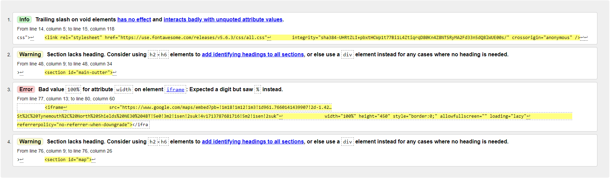

- Menu initial test

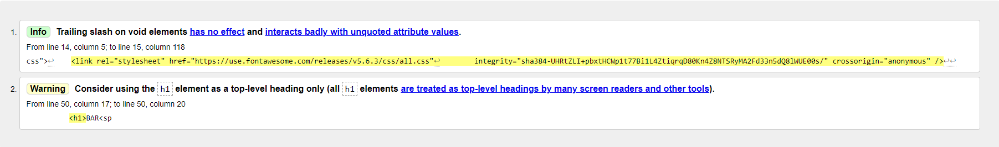

- Merch initial test

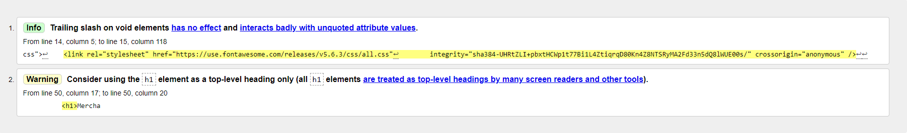

Following the tests, I went through the HTML for all of the pages and fixed the errors. The results were as follows:

- Home 

    I went into the Home page HTML and changed some of the sections to divs which worked well, rectified the warnings and did not impact the responsiveness of the page. I removed the trailing "/" from the stylesheet, rectifying that and cleaning the code. Fixing the error was a little more work to figure out but I edited the style of the iframe which fixed the error and produced the following result when tested:

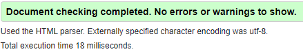 

- Menu

    I went into the Menu page HTML and removed the "/" from the stylesheet and changed the "h1" to a "h2" in the main section, rectifying the issues on that page. The following results were produced when tested:

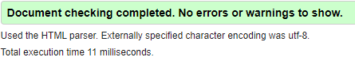

- Merch

    I repeated the steps above to rectify the issues on the Merch page. The following results were produced when tested:

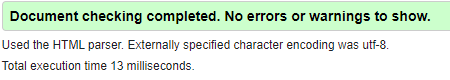

#### W3 Validator - CSS

In order to conduct testing on the CSS implemented in my site, I used the [W3C CSS Validator](https://jigsaw.w3.org/css-validator/). The initial results were as follows:

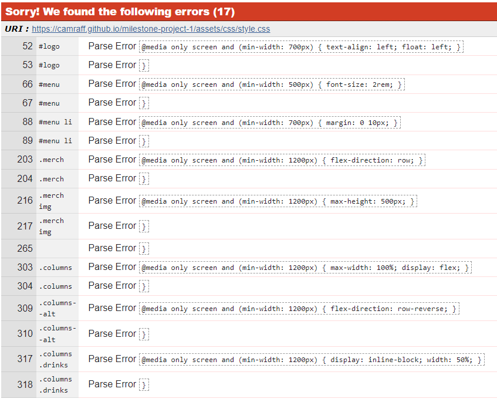

In order to rectify these issues, I had to remove the Media Qeurys which were nested in the CSS. After doing so, everything maintained its responsiveness and the results were as follows:

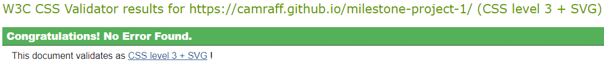

#### Lighthouse

As another method of automatic testing, I ran each of my three pages though Lighthouse on Google Dev Tools. Lighthouse tests 4 main areas of your site, them being its Performance, its Accessibility, how well it conforms with Best Practices and also how well it would perform when being searched for in a browser, its Search Engine Optimization (SEO). The PWA section is being depreciated by Lighthouse in future releases, so there are no values given here. The following results were acquired when the initial tests were ran:

##### Desktop

- Home

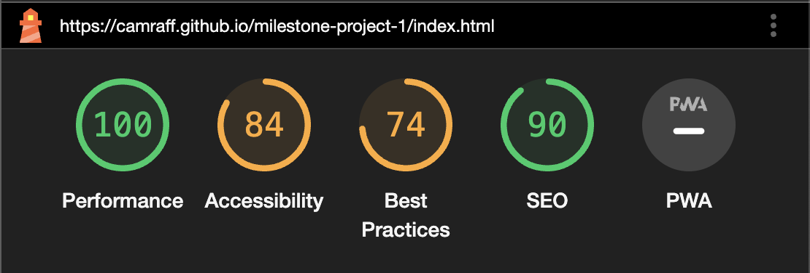

- Menu

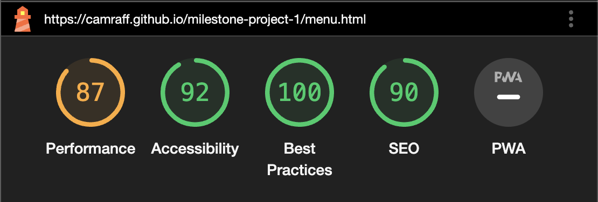

- Merch

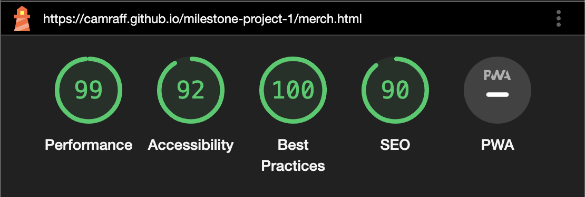

##### Mobile

- Home

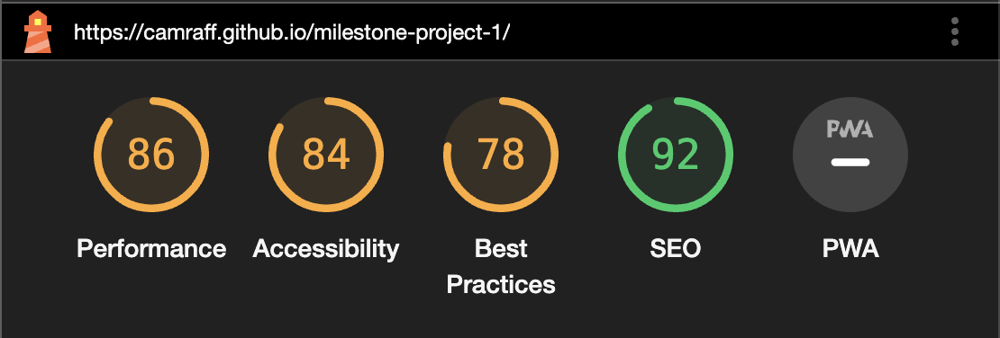

- Menu

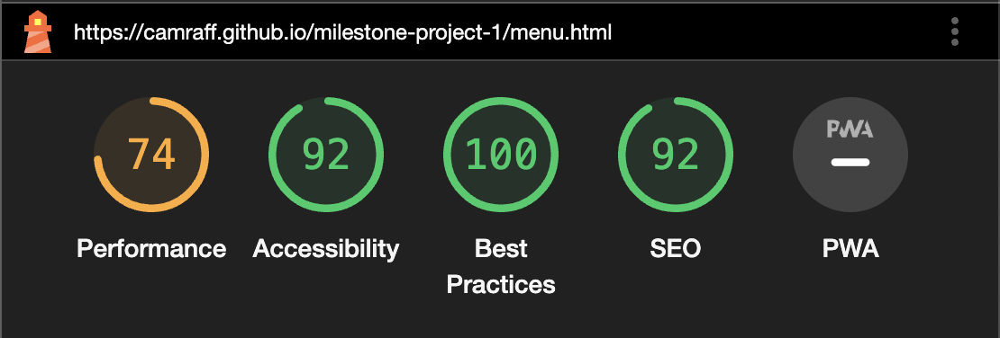

- Merch 

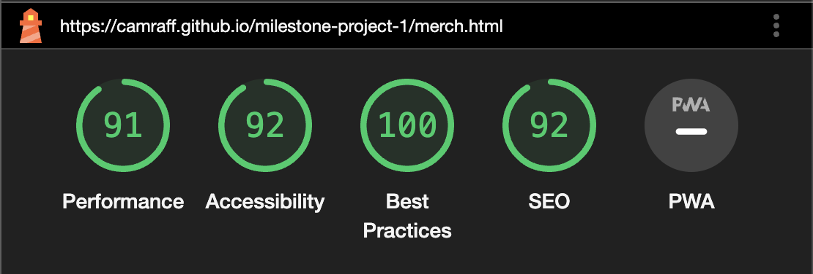

As you can see from the above results, there were several areas which could be improved upon. The main issues being flagged by Lighthouse were the image sizing/file types for performance, lack of titles for accessibility and my webpage didn't have a description in its head, meaning that its SEO wasn't as good as it could have been. 

There was an issue on the Home page regarding Best Practices relating to Third Party Cookies from the iframe I was using. Unfortunately I was unable to rectify this as I believe this would have been something implemented via JavaScript. 

Following on from changes made to the image sizes, iframes, social media links and metadata, the results for each page were as follows:

##### Desktop

- Home

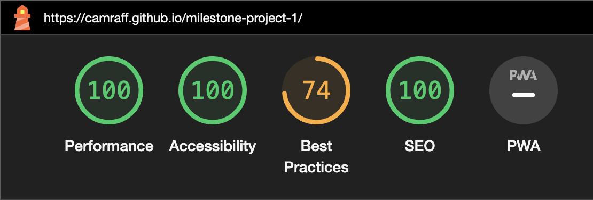

- Menu

- Merch

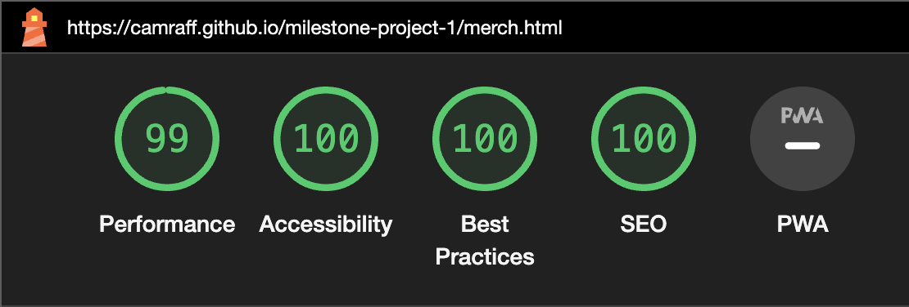

##### Mobile

- Home 

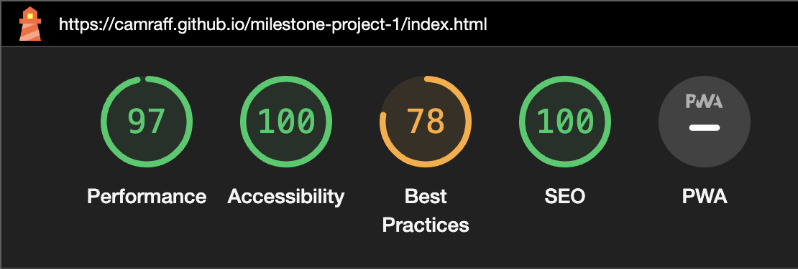

- Menu

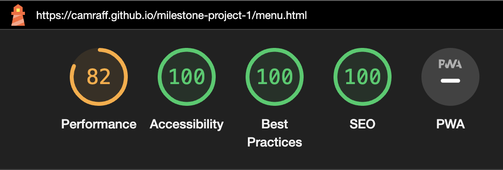

- Merch 

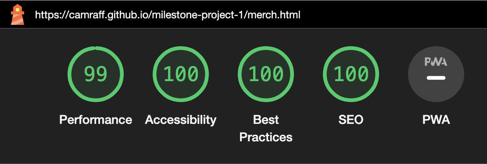

As you can see from the changes made, the Performance score of the website increased on all pages. The Accessability on all pages increased to 100 on both desktop and mobile views, along with SEO. Best practices increased to 100 on both the Menu and Merch page, and the Home page maintained the score of 74 and 78 for the desktop and mobile views respectively (third party cookies issue).

### Manual

#### User Stories

**First Time Visitor Goals**

| Goals | Outcome |
| ----- | ----- |
| I want to understand what the situation with Barca Tynemouth is, like opening times and location. | Upon visiting the Home page, opening times and location information are visible. |
| I want to get a feel for the vibe of the venue and the menu. | Upon visiting the site and looking at the graphics, colours and Menu page, I get an understanding of the kind of place Barca is. |
| I am interested in purchasing merchandise if possible. | Upon visiting the site I can see a Merch section in the navigation bar. |
| I want to be able to access and navigate the website easily regardless of what device I choose to use. | I am able to access the website on my phone and my laptop, and the site looks good on both. |

**Returning Visitor Goals**

| Goals | Outcome |
| ----- | ----- |
| I want to see if there are any new events or merchandise on the site. | When visiting the Merch page, you get told that merchandise is updated regularly, so I should check back soon to see if there is anything new. |

**Frequent Visitor Goals**

| Goals | Outcome |
| ----- | ----- |
| I want the option to reach out via socials to get updates on events and merchandise. | There are social network links in the footer of the page meaning I can view updates and get in touch if I please! |

#### Site Testing

This site was built using VSCode as my chosen IDE. The majority of the development was undertaken on a Windows laptop before upgrading to a MacBook where the final changes and majority of final tests were done.

The devices I used to test my site throughout development and upon completion are:

- Windows laptop - ASUS ROG Gaming Laptop, 17.3".

- MacBook Air 15", M2.

- Mobile - Apple iPhone 15 Pro Max.

I tested the site using three different browsers on both the laptop and mobile, them being Safari, Google Chrome, and Mozilla Firefox. The site worked as expected on all three browsers on both platforms, and the desired styling was displayed. The laptop and mobile views are below for each browser:

- Safari

    - Laptop 

    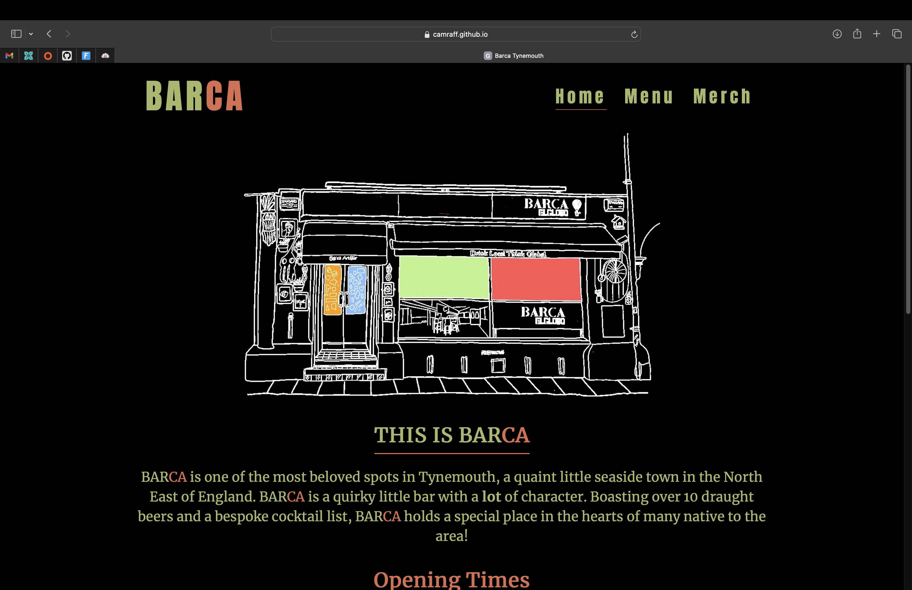

    - Mobile 

    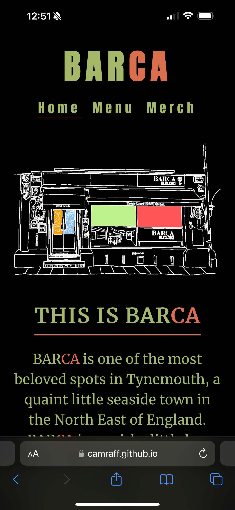

- Chrome

    - Laptop

    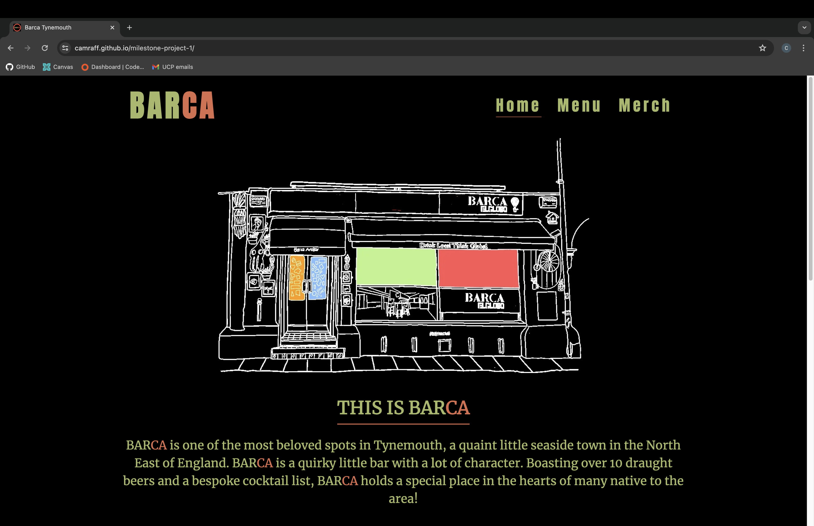

    - Mobile

    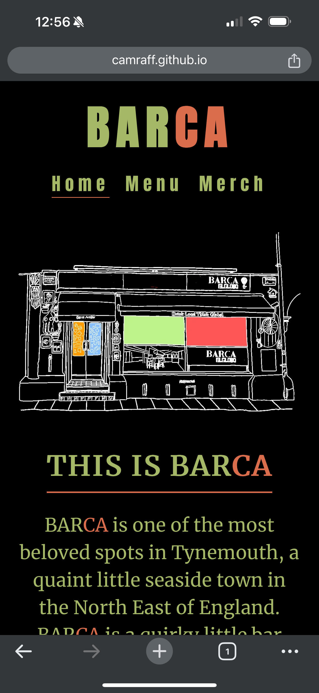

- Firefox

    - Laptop

    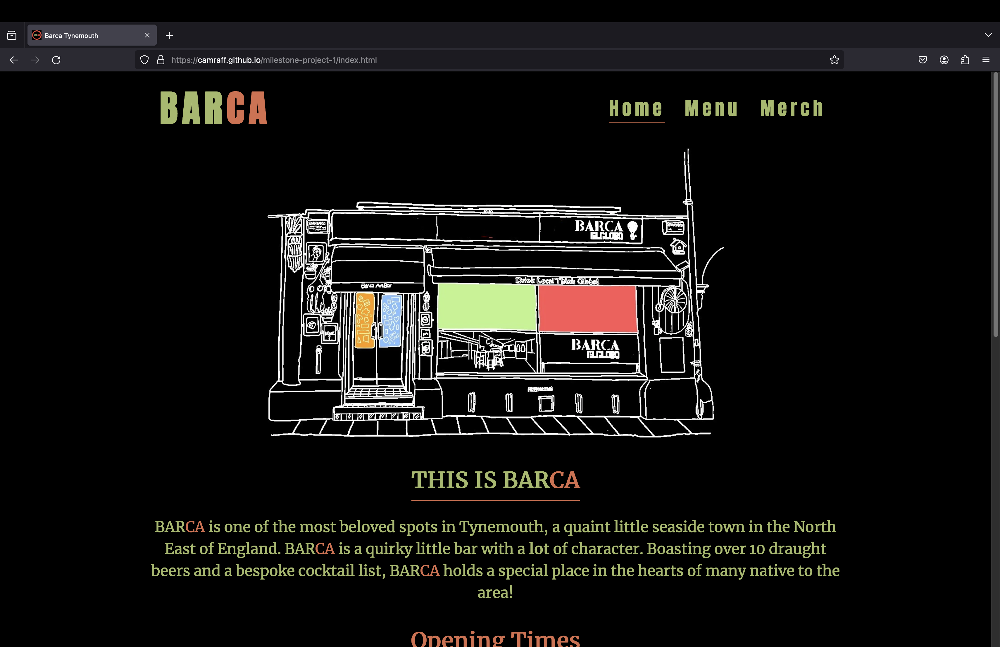

    - Mobile

    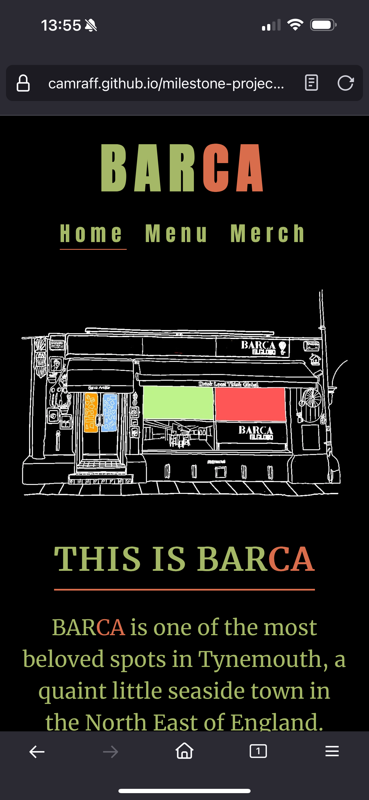

Below are some screenshots taken showing how the pages responds when the browser size is manipulated on a laptop:

- Home

    - Large

    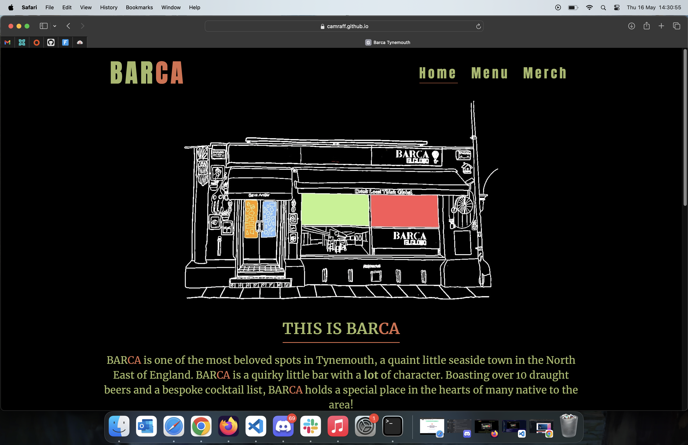

    - Medium

    

    - Small

    

- Menu

    - Large

    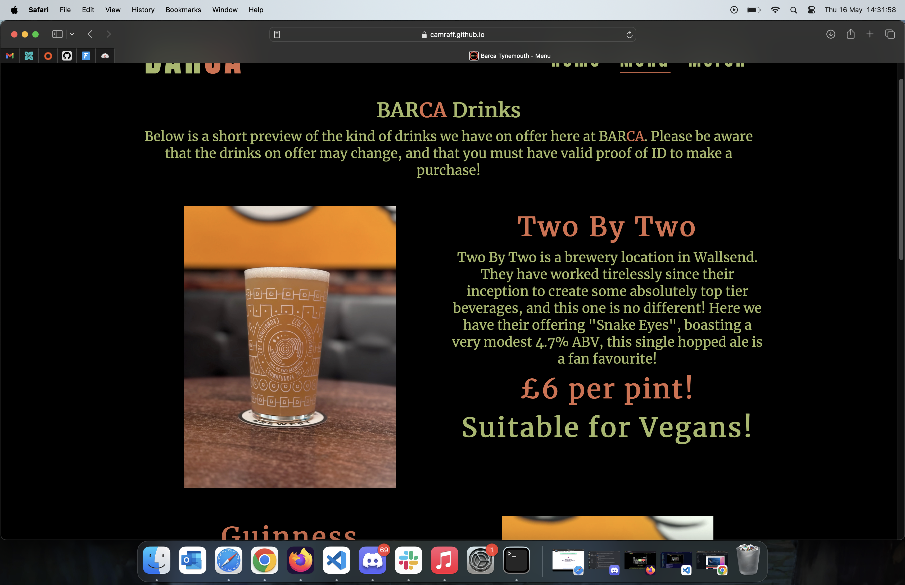

    - Medium

    

    - Small 

    

- Merch

    - Large

    

    - Medium

    

    - Small

    

#### Feature Testing

There are features that differ between each page, however, the Header and the Footer remained the same across all 3 pages, with hover effects, active effects and navigational links. The Home page was designed so the layout would stay the same across all platforms. The Menu page had CSS implemented so that, when on a larger screen, the images and descriptions would alternate sides between drinks. The Merch page had CSS implemented so that, when on a larger screen, you hover over an image and the description and price of the item appear. Testing for all of these features were as follows:

**Header**

| Feature | Expectation | Test Performed | Outcome | 
| ----- | ----- | ----- | ----- | 
| Barca Title | Navigate back to home page | Clicked on all pages | Refreshed on the Home page and returned to the Home page on all others |
| Navigation Links | Take the user to the desired page | Clicked on all pages | Went to the desired page |
| Nav Hover Effect | Menu items will change color | Hovered over each option | Color changed as desired |
| Active Effect | The page you're on will be underlined | Accessed each page | The page you're currently on is underlined in the Nav bar |

**Footer**

| Feature | Expectation | Test Performed | Outcome |
| ----- | ----- | ----- | ----- |
| Footer Links | Take you to desired social media platform| Clicked link | Taken to the platform I desired |
| Footer Hover | Icon will change color | Hovered over each icon | Icon color changed as desired | 

**Home Page**

| Feature | Expectation | Test Performed | Outcome |
| ----- | ----- | ----- | ----- |
| Responsive Content | Content will respond and be viewable on different devices | Opened page on different sized displays | Page responded as desired | 

**Menu Page**

| Feature | Expectation | Test Performed | Outcome | 
| ----- | ----- | ----- | ----- |
| Responsive Content | Content will alternate depending on display size | Opened the page on different sized displays | Content alternated (img left then img right) as you scrolled on a larger display, and rearranged vertically on a smaller display, as desired |

**Merch Page**

| Feature | Expectation | Test Performed | Outcome |
| ----- | ----- | ----- | ----- |
| Hover Effect | Description and price will appear on hover when on a laptop/desktop view | Hovered over images | Description and prices appeared as desired |
| Responsive Content | Content will shift based on display size | Opened the page on different sized displays | Content shifted from horizontal on a large display to vertical on a smaller display, as desired |  

---

## Credits

### Outside Code

- I couldn't quite figure out how to get the images on the Merch page to show the description and pricing when hovering, so I did a quick google and found a good bit of code on a website called [Stack Overflow](https://stackoverflow.com/questions/14263594/how-to-show-text-on-image-when-hovering). I copied this and edited it to make it work within my site.

### Images

- All of the images (except the social media icons, which are from [Font Awesome](https://fontawesome.com)) used in this project were either taken or developed by staff members at Barca. 

### Core Content

- All of the content, including drinks descriptions, was written by myself.

### Acknowledgements 

I would like to say a special thank you to several individuals:

- Ronan McClelland - my Code Institute mentor, for their helpful and kind manner in which they conduct themselves. They have made attempting a coding project like this a lot more pleasant with their knowledge and understanding.

- Mark Nevison - one of the students in my cohort. They were always extremely helpful whenever I asked, no matter how menial my issue may have been. 
